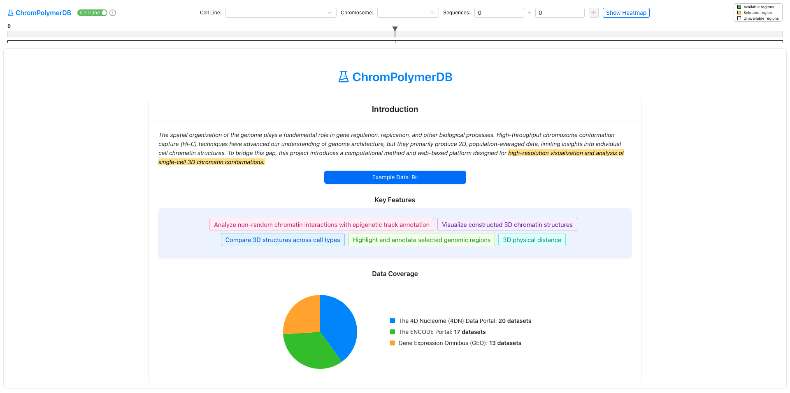
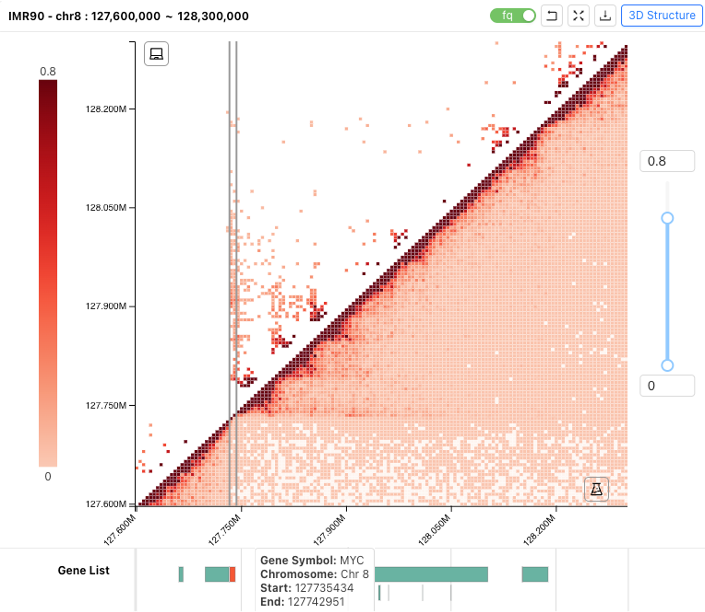
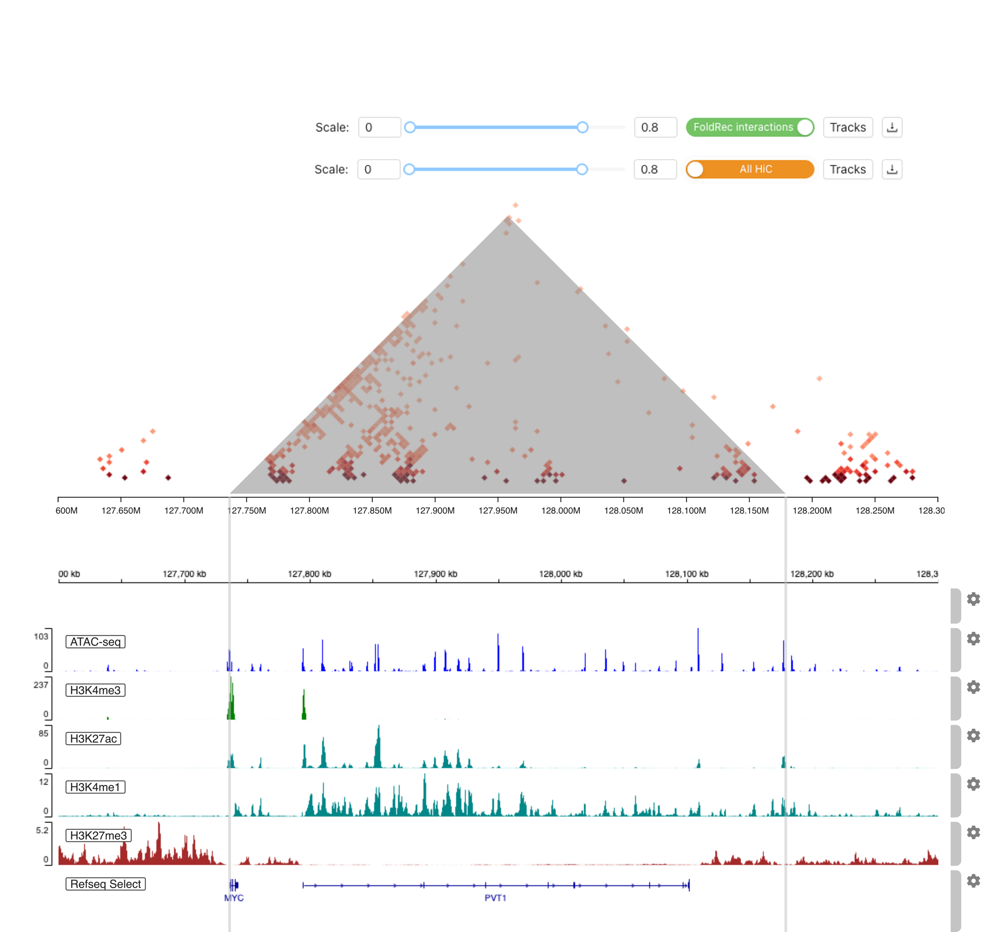
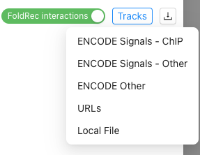
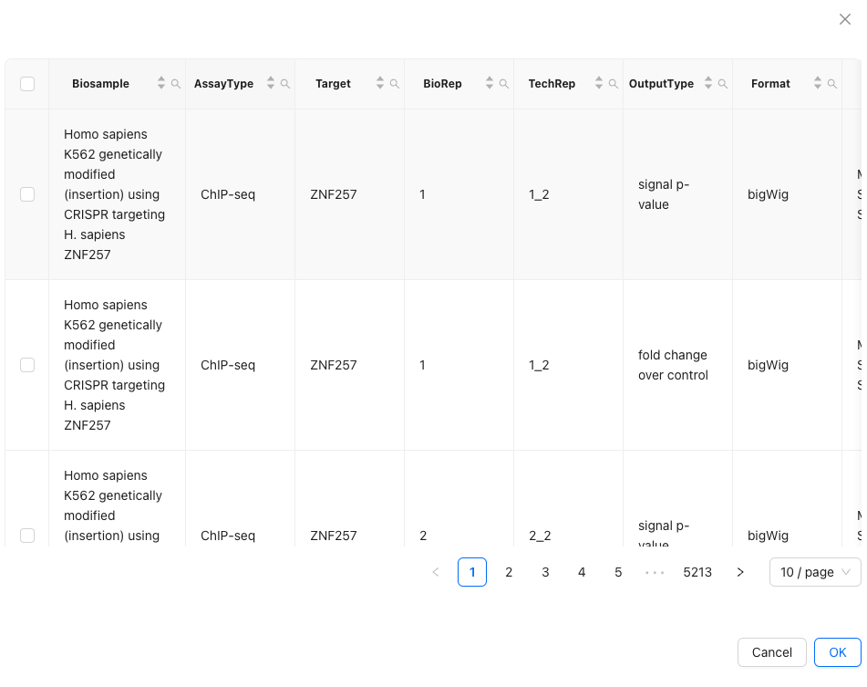
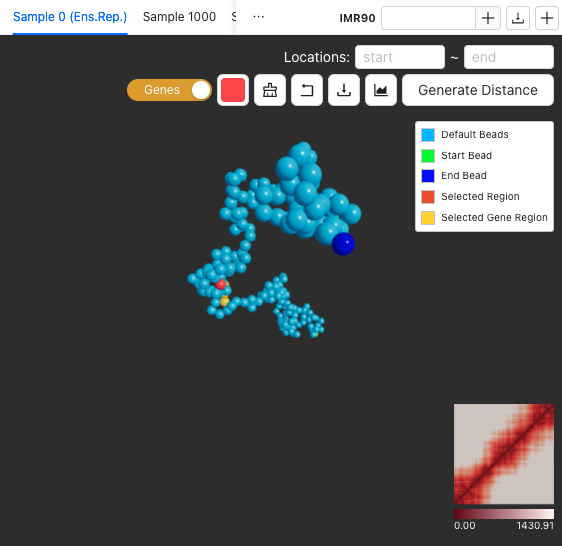
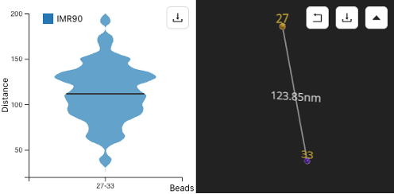
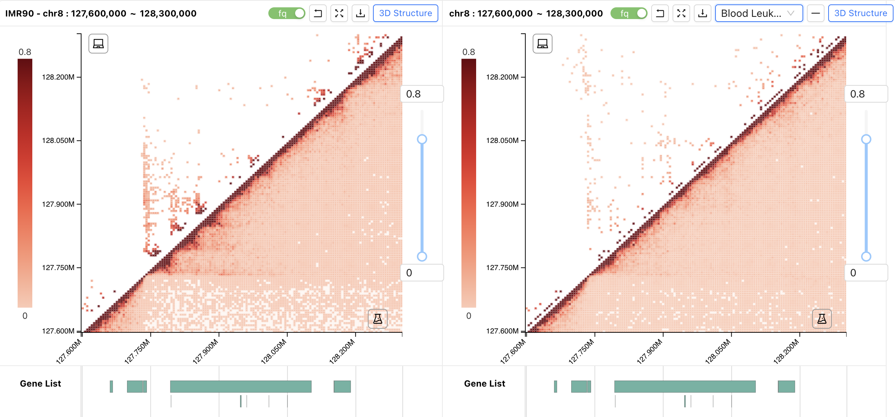
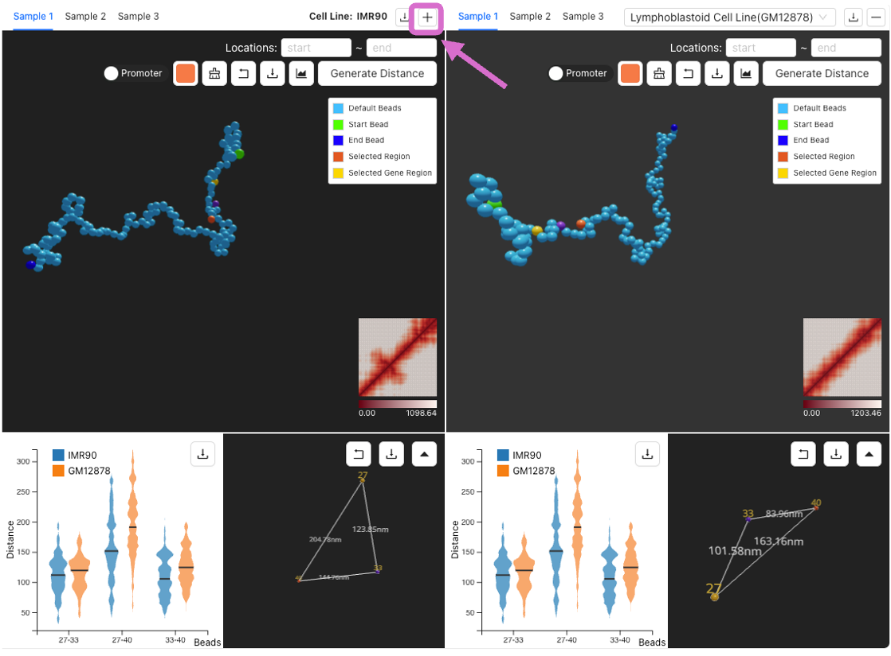

# ChromPolymerDB_Tutorial

<!-- ABOUT THE PROJECT -->
The spatial organization of the genome plays a fundamental role in gene regulation, replication, and other biological processes. High-throughput chromosome conformation capture (Hi-C) techniques have advanced our understanding of genome architecture, but they primarily produce 2D, population-averaged data, limiting insights into individual cell chromatin structures. To bridge this gap, this project introduces a computational method and web-based platform designed for high-resolution visualization and analysis of single-cell 3D chromatin conformations.

<!-- GETTING STARTED -->
## Querying the Data

- Our database provides two ways to query the Hi-C data:
  1. Based on the cell line name and genomic location.

     
     
  2. Based on the cell line name and gene name.

     

After entering all the information, click the <code style="color : Cyan">Show Heatmap</code>
<!-- GETTING STARTED -->
## Examine the FoldRec interactions

Here we took IMR90 chr8:127,600,000-128,300,000 as an example.

- The upper panel showed the selected cell line and region. 
   - The tool buttons on the right are:
      - Restore the original heatmap
      - Expand the heatmap view
      - Download FoldRec interaction data
      - Generate the 3D single-cell structures 
- The middle panel showed the chromatin interactions heatmap. 
   - The upper triangle of the heatmap shows the FoldRec inteactions and the lower triangle of the heatmap shows the experiment Hi-C data. The color scale represent the interaction frequency. 
   - Users can change the color scale using the slide bar on the right.
   - Users can click and drag the heatmap to zoom in and out.
- The lower panel showed the gene information in this region, users can select and click the gene to highlight it. Here we select MYC gene.

#### By clicking    (Expand the heatmap view). We can check the FoldRec interactions in details with epigentic tracks from ENCODE

- The upper panel showed the tool buttons:
   - Scale bar to change the heatmap color scale 
   - Swith button to swich between FoldRec interactions and All HiC data
   - Tracks button to select epigenitic tracks from ENCODE or uplode local files
   - Download the figures
- The middle panel showed the FoldRec interactions. Users can click the heatmap to highlight selected interations
- The lower panel is the embeded igv epigenitic tracks. Users can search and select or upload their own epigenitc tracks data they are interested in to annotate the interactions.

<!-- GETTING STARTED -->
## Generating the 3D single-cell chromatin structures

After examining the FoldRec interactions, users can click    to generate the 3D single-cell chromatin structures

- Switch between different Sample chains
- Download the 5,000 3D single-cell chromatin chain position and beads distance matrix data
- Add a second cell line to compare
- The upper panel showed the tool buttons:
   - Locations to select the beads.
   - Switch button to switch promoter of the gene and whole selected gene.
   - Change the color of the selected beads
   - Clear the bead selections
   - Restore the original view
   - Download the 3D chromosome image. User can also change the background color the chains before download the image.
   - Check the simulated Hi-C heatmap
   - Generate pairwise distances for selected beads
- The middle panel showed the simulated 3D single-cell chromatin structure.
- The lower right panel showed the distance heatmap of this 3D single-cell chromatin structure.

#### After selecting beads and clicking <code style="color : dark gray">Generate Distance</code>, the pairwise 3D distance and the distribution among 5,000 simulated structures of selected beads will show up. 

  

- The tool buttons:
   - Restore the original view
   - Download the selected beads and their distance
   - Collapse the distance window

<!-- GETTING STARTED -->
## Comparision among cell lines

### FoldRec interactions comparision

By clicking the + on the right of the data query bar. Users can select other cell lines to do the FoldRec interactions comparision.

### 3D chromatin structures comparision 

By clicking the + on the right of the chromatin structure window. Users can select other cell lines to do the chromatin struction comparision.

