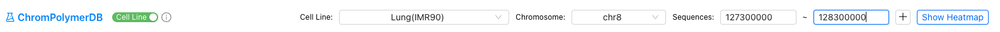
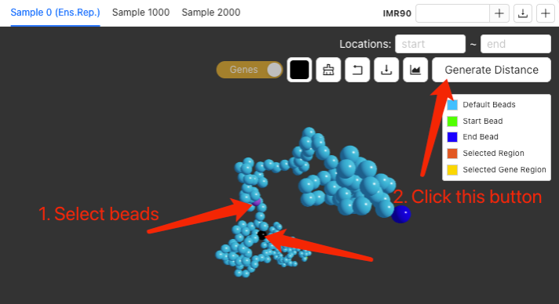

# ChromPolymerDB_Tutorial

<!-- ABOUT THE PROJECT -->
ChromPolymerDB is a comprehensive and publicly accessible 3D chromatin structure database that provides large scale high resolution single-cell 3D chromatin structure data alongside an interactive web interface and integrated structural analytical toolkit. By enabling fine-scale, integrative, and single-cell-resolved structural genomics, researchers can easily use it for investigating the interplay between chromatin architecture and gene regulation and performing comparative 3D genomics.

<!-- GETTING STARTED -->
## Querying the Data

- There are two ways to query the Hi-C data and corresponding single-cell chromatin structures:
  1. Based on the cell line name and genomic location.

     
     
  2. Based on the cell line name and gene name.

     

After entering all the information, click 
<!-- GETTING STARTED -->
## Examine 2D Contact Patterns (Hi-C experiment data + FoldRec Interactions)

Here we take IMR90 chr8:127,600,000-128,300,000 as an example.

- The upper panel shows the contact information within the corresponding region of the selected cell sample. 
   - The tool buttons on the right are:
      - FoldRec interactions pairwise comparison.
      - Restore the original heatmap.
      - Expand the heatmap view.
      - Download FoldRec interaction data.
      - Generate the 3D single-cell structures. 
- The middle panel shows the chromatin interactions heatmap. 
   - The upper triangle of the heatmap shows the FoldRec inteactions and the lower triangle of the heatmap shows the experiment Hi-C data. The color scale represent the interaction frequency. 
   - Users can change the color scale using the slide bar on the right.
   - Users can click and drag the heatmap to zoom in and out.
- The lower panel shows the informatins of all genes located in selected region, and users can select and click the gene to highlight it. Here we highlight MYC gene.

#### By clicking    (Expand the heatmap view), users can check the FoldRec interactions in details with epigenetic tracks from the ENCODE Portal or their own custom tracks 

- The upper panel shows the tool buttons:
   - Scale bar to change the heatmap color scale. 
   - Swith button to swich between FoldRec and All HiC interactions.
   - Tracks button to select epigenitic tracks from ENCODE or upload local files.
   - Refresh button to refresh the igv track viewer.
   - Download the figures (PDF/PNG).
- The middle panel shows the FoldRec interactions. Users can click the heatmap to highlight the selected interactions.
- The lower panel is the embedded IGV Epigenitic Track Viewer. Users can search and select epigenetic data from the ENCODE Portal or upload their own tracks to annotate the interactions.

<!-- GETTING STARTED -->
## Generating the 3D single-cell chromatin structures

After examining the FoldRec interactions, users can click    to generate the 3D single-cell chromatin structures.

- The Sample 0 (Ens.Rep.) shows the most representative single-cell structure (highest correlation with average). 
- Switch between simulated single cell chromatain chains, users can also examine selected samples based on the sample ID.
- Download 5,000 single-cell 3D chromatin chains, including positional coordinates and beads-to-beads distance matrices.
- Add an additional cell sample to do comparison.
- The upper panel shows the tool buttons:
   - Regions of interest for beads selection.
   - Switch button to switch the TSS of the gene and whole selected gene.
   - Change the color of the selected beads.
   - Clear the bead selections.
   - Restore the original view.
   - Download the 3D chromosome image (PDF/PNG). User can also change the background color the chains before download the image.
   - Check the simulated Hi-C heatmap.
   - Generate pairwise distances for selected beads.
- The middle panel displays one of the simulated 3D single-cell chromatin structure. Users may interact with the model by clicking and dragging to examine its spatial organization.
- The lower right panel showed the distance heatmap of this 3D single-cell chromatin structure.

#### After selecting beads and clicking  , the pairwise 3D distance and the distribution among 5,000 simulated structures of selected beads will show up. 

  

- The tool buttons:
   - Restore the original view.
   - Download the selected beads and their distance.
   - Collapse the distance window.

<!-- GETTING STARTED -->
## Comparision among different cell samples

### FoldRec interactions comparision

By clicking the + on the right of the data query bar. Users can select other cell samples to do the FoldRec interactions comparision.

### 3D chromatin structures comparision 

By clicking the + on the right of the chromatin structure window. Users can select other cell samples to do the chromatin struction comparision.

<!-- GETTING STARTED -->
## Structure data analysis

All structure data of the selected region can be downloaded and do the downstream analysis. Please check the following codes for more details.

- [Distance data clustering](scr/clustering.ipynb)

- [Position data to PDB files for structure visualization via PyMol](scr/position_data_visualizaion.ipynb)
