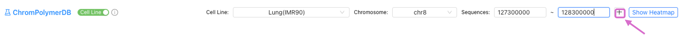

# ChromPolymerDB_Tutorial

<!-- ABOUT THE PROJECT -->
The three-dimensional (3D) organization of chromatin is well known to play an essential role in a wide range of biological functions. A deeper understanding of chromatin structures is crucial for decoding critical biology processes. To support the exploration of chromatin architecture, we developed ChromPolymerDB, a publicly accessible, high-resolution database of single-cell 3D chromatin structures reconstructed using polymer physics-based modeling of Hi-C data. This database covers a substantial number of single-cell chromatin structures at 5 kb resolution across 50 diverse human cell types and experimental conditions. It provides an interactive web interface with integrated spatial and structural analysis tools, enables multi-omics integration with gene expression, epigenetic marks, and other regulatory elements, and allows comparative analysis to identify structural rewiring events—such as enhancer hub emergence or loop remodeling—across conditions, developmental stages, or disease states. These innovations make ChromPolymerDB a powerful tool for researchers investigating the interplay between chromatin architecture and gene regulation and performing comparative 3D genomics.

ChromPolymerDB is available online at: https://chrompolymerdb.bme.uic.edu/

<!-- GETTING STARTED -->
## Querying the Data

- There are two ways to query the Hi-C data and corresponding single-cell chromatin structures:
  1. Based on the cell line name and genomic location.

     
     
  2. Based on the cell line name and gene name.

     

After entering all the information, click 
<!-- GETTING STARTED -->
## Examine 2D Contact Patterns (Hi-C experiment data + FoldRec Interactions)

Here we take IMR90 chr8:127,600,000-128,300,000 as an example.

- The upper panel shows the contact information within the corresponding region of the selected cell sample. 
   - The tool buttons on the top-right are:
      - FoldRec interactions pairwise comparison.
      - Restore the original heatmap.
      - Expand the heatmap view.
      - Download FoldRec interaction data.
      - Generate the 3D single-cell structures. 
- The middle panel shows the heatmap of chromatin interactions. 
   - The upper triangle of the heatmap shows the FoldRec inteactions and the lower triangle shows the experiment Hi-C data. The color scale represent the interaction frequency. 
   - Users can change the color scale using the slide bar on the right.
   - Users can click and drag the heatmap to zoom in and out.
- The lower panel shows the informatins of all genes located in selected region, and users can select and click the gene to highlight it. Here we highlight MYC gene.

#### By clicking    (Expand the heatmap view), users can check the FoldRec interactions in details with epigenetic tracks from the ENCODE Portal or their own custom tracks 

- The upper panel shows the tool buttons:
   - Scale bar to change the heatmap color scale. 
   - Swith button to swich between FoldRec and experiment Hi-C interactions.
   - Tracks button to select epigenitic tracks from ENCODE or upload local files.
   - Refresh button to refresh the igv track viewer. （If the tracks and the heatmap are misaligned, “Refresh” is needed.）
   - Download the figures (PDF/PNG).
- The middle panel shows the FoldRec interactions. Users can click the heatmap to highlight the selected interactions.
- The lower panel is the embedded IGV Epigenitic Track Viewer. Users can search and select epigenetic data from the ENCODE Portal or upload their own tracks to annotate the interactions.

<!-- GETTING STARTED -->
## Exploring the 3D single-cell chromatin structures

After examining the 2D contact information, users can click    to generate the 3D single-cell chromatin structures of the corresponding locus.

- The Sample 0 (Ens.Rep.) shows the most representative single-cell structure (highest correlation with average), and users can switch among all available structures or examine specific samples by entering a sample ID.
- Download 5,000 single-cell 3D chromatin chains, including positional coordinates and beads-to-beads distance matrices.
- Add an additional cell sample to do comparison.
- The upper panel shows the tool buttons:
   - Regions of interest for beads selection.
   - Switch button to switch the TSS of the gene and whole selected gene.
   - Change the color of the selected beads.
   - Clear the bead selections.
   - Restore the original view.
   - Download the 3D chromosome image (PDF/PNG). User can also change the background color the chains before download the image.
   - Check the simulated Hi-C heatmap.
   - Generate pairwise distances for selected beads.
- The middle panel displays one of the simulated 3D single-cell chromatin structure. Users may interact with the model by clicking and dragging to examine its spatial organization.
- The lower right panel showed the distance heatmap of this 3D single-cell chromatin structure.

#### After selecting beads and clicking  , the pairwise 3D distance and the distribution among 5,000 simulated structures of selected beads will show up. 
- We disabled this button until minimum number of beads selection is made.

  

  

- The tool buttons:
   - Restore the original view.
   - Download the selected beads and their distance.
   - Collapse the distance window.

<!-- GETTING STARTED -->
## Comparision among different cell samples

### 2D interaction pattern comparision

By clicking the + on the right of the data query bar. Users can select other cell samples to do the FoldRec interactions comparision.

### 3D chromatin structures comparision 

By clicking the + on the right of the chromatin structure window. Users can select other cell samples to do the chromatin struction comparision.

<!-- GETTING STARTED -->
## Structure data analysis
Both bead structure data (position data) and bead distance data of the selected region can be downloaded and used for downstream analysis. Please check the following codes for more details.

  

- [Distance data clustering](scr/clustering.ipynb)

- [Position data to PDB files for structure visualization via PyMol](scr/position_data_visualizaion.ipynb)

<!-- GETTING STARTED -->
## Incorporating Data from Existing Chromatin Resources
Users can download data from other publicly available chromatin databases and incorporate them into ChromPolymerDB for further analysis. Here we take HiChIPdb as an example.
Step-by-step guide:
- Download the .csv file from HiChIPdb (https://health.tsinghua.edu.cn/hichipdb/download.php). For consistency, we recommend using the 5 kb resolution data.
- Extract the columns: anchor1, anchor2, and qValue and Rreformat these columns into a .bedpe file, as shown in the figure below.

- Convert .bedpe files from hg19 to hg38.
   - wget https://hgdownload.cse.ucsc.edu/goldenpath/hg19/liftOver/hg19ToHg38.over.chain.gz
   - CrossMap bed hg19ToHg38.over.chain.gz hichipdb_GM12878_H3K27ac.bedpe hichipdb_GM12878_H3K27ac_hg38_1.bedpe
   - awk '{OFS="\t"}{print $4,$5,$6,$1,$2,$3,$7}' hichipdb_GM12878_H3K27ac_hg38_1.bedpe > hichipdb_GM12878_H3K27ac_hg38_2.bedpe
   - CrossMap bed hg19ToHg38.over.chain.gz hichipdb_GM12878_H3K27ac_hg38_2.bedpe hichipdb_GM12878_H3K27ac_hg38.bedpe
